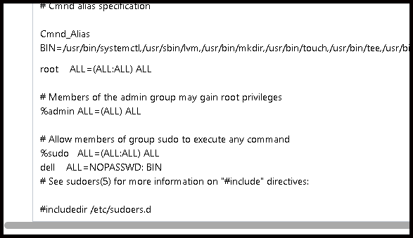
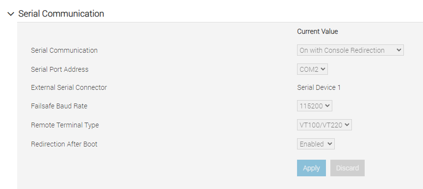
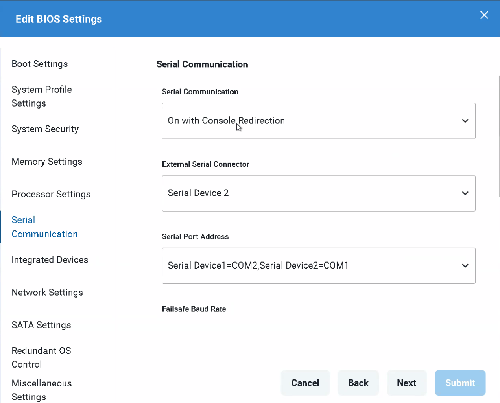

# Dell TELCO Infrastructure Automation Suite (DTIAS) Examples

- [Dell TELCO Infrastructure Automation Suite (DTIAS) Examples](#dell-telco-infrastructure-automation-suite-dtias-examples)
  - [What is DTIAS?](#what-is-dtias)
  - [About This Repository](#about-this-repository)
  - [Useful Links](#useful-links)
  - [Contributing](#contributing)
  - [DTIAS on Ubuntu 20.04 Prerequisites](#dtias-on-ubuntu-2004-prerequisites)
  - [DTIAS on RHEL Prerequisites](#dtias-on-rhel-prerequisites)
  - [DTIAS Single Node Installation](#dtias-single-node-installation)
  - [Set Up a Baseline - Console Redirection](#set-up-a-baseline---console-redirection)
  - [How to Setup Telemetry](#how-to-setup-telemetry)

## What is DTIAS?

DTIAS is designed to handle environments with large numbers of heterogenous servers. You don't need to be a TELCO to use it, but this is a core problem TELCOs face. DTIAS supports both HPE and Dell and has the ability to perform full lifecycle management of the servers. It has built in functionality to take a server from bare metal to with a few clicks standardized BIOS settings, up to date firmware, and a deployed and configured operating system. 

## About This Repository

This repository is dedicated to demonstrating the capabilities of Dell DTIAS. It has [API usage examples](./dtias_api_examples/) which show off how to control DTIAS through the API and a [blueprint repository](./blueprints/) with a host of useful, prebuilt, blueprints you can deploy.

## Useful Links

- [DTIAS REST API Documentation](https://developer.dell.com/apis/7ce7d11a-ff9c-47cc-b958-bd30dc9770f0/versions/2.1.0/docs/introduction.md)
  - Note: DTIAS has recently merged with Cloudify. If you notice discrepancies in the API documentation feel free to open a ticket on this repository.
- [Dell Telecom Infrastructure Automation Suite 2.1 SDK Guide](https://infohub.delltechnologies.com/en-us/t/dell-telecom-infrastructure-automation-suite-2-1-software-development-kit-guide/)
- [Dell Telecom Infrastructure Automation Suite 2.1 Installation and Administration Guide](https://infohub.delltechnologies.com/en-us/l/dell-telecom-infrastructure-automation-suite-2-1-installation-and-administration-guide/preface-95/)

## Contributing

For required coding style and structure guidelines see [CONTRIBUTING.md](./CONTRIBUTING.md)

## DTIAS on Ubuntu 20.04 Prerequisites

As user do the following (do not use root):

```bash
USER="grant"

# Add Docker's official GPG key:
sudo apt-get update
sudo apt-get install ca-certificates curl
sudo install -m 0755 -d /etc/apt/keyrings
sudo curl -fsSL https://download.docker.com/linux/ubuntu/gpg -o /etc/apt/keyrings/docker.asc
sudo chmod a+r /etc/apt/keyrings/docker.asc

# Add the repository to Apt sources:
echo "deb [arch=$(dpkg --print-architecture) signed-by=/etc/apt/keyrings/docker.asc] https://download.docker.com/linux/ubuntu \
  $(. /etc/os-release && echo "$VERSION_CODENAME") stable" | \
  sudo tee /etc/apt/sources.list.d/docker.list > /dev/null
sudo apt-get update -y
sudo apt-get install -y docker-ce docker-ce-cli containerd.io docker-buildx-plugin docker-compose-plugin
sudo usermod -aG docker $USER
sudo systemctl daemon-reload
sudo systemctl restart docker.service
sudo apt-get install -y make ntp ntpdate open-iscsi bash curl util-linux grep gawk nfs-common jq coreutils python3-pip net-tools
sudo systemctl enable ntp
sudo systemctl start ntp
sudo systemctl status ntp
sudo ntpdate -u time.google.com

# Append the required configuration to /etc/sysctl.conf if not already present
sudo tee -a /etc/sysctl.conf > /dev/null <<EOL
fs.inotify.max_user_watches = 1048576
fs.inotify.max_user_instances = 8192
vm.max_map_count = 262144
EOL

# Apply the changes immediately
sudo sysctl -p

CMND_ALIAS="Cmnd_Alias BIN=/bin/sh,/var/lib/rancher/rke2/bin/crictl,/usr/bin/systemctl,/usr/sbin/lvm,/usr/bin/mkdir,/usr/bin/touch,/usr/bin/tee,/usr/bin/sed,/usr/bin/umount,/usr/bin/mount,/usr/bin/rmdir,/usr/sbin/mkfs.xfs,/usr/sbin/lvs,/usr/sbin/pvcreate,/usr/sbin/pvremove,/usr/sbin/vgcreate,/usr/sbin/vgdisplay,/usr/sbin/vgremove,/usr/sbin/lvcreate,/usr/sbin/lvremove,/usr/bin/awk,/usr/bin/chown,/usr/bin/chmod,/usr/bin/echo,/usr/bin/cat,/usr/bin/cp,/usr/bin/rm,/bin/systemctl,/bin/mkdir,/bin/sed,/bin/umount,/bin/rmdir,/sbin/mkfs.xfs,/bin/chown,/bin/chmod,/bin/echo,/bin/cat,/bin/cp,/bin/rm,/usr/bin/docker,/usr/local/bin/helm"

# Create a new sudoers file
echo "$CMND_ALIAS" | sudo tee /etc/sudoers.d/custom-sudoers > /dev/null
echo "$USER ALL=NOPASSWD: BIN" | sudo tee -a /etc/sudoers.d/custom-sudoers > /dev/null

# Ensure proper permissions for the sudoers file
sudo chmod 440 /etc/sudoers.d/custom-sudoers

# Validate the sudoers configuration to ensure no syntax errors
sudo visudo -cf /etc/sudoers.d/custom-sudoers
if [ $? -ne 0 ]; then
    echo "Error: The sudoers file contains syntax errors."
    exit 1
else
    echo "Passwordless sudo for $USER configured successfully."
fi
```

## DTIAS on RHEL Prerequisites

Run the following. Make sure to replace the username with whatever user you're going to use for DTIAS

```bash
sudo dnf update -y
sudo dnf -y install dnf-plugins-core
sudo dnf config-manager --add-repo https://download.docker.com/linux/rhel/docker-ce.repo
dnf install -y epel-release
sudo dnf install -y docker-ce docker-ce-cli containerd.io docker-buildx-plugin docker-compose-plugin make wget curl util-linux grep chrony gawk nfs-utils jq coreutils python3-pip net-tools bash curl util-linux grep gawk nfs-utils jq coreutils python3-pip https://dl.fedoraproject.org/pub/epel/epel-release-latest-9.noarch.rpm
sudo systemctl enable --now docker
sudo usermod -aG docker grant # REPLACE THIS WITH YOUR INSTALL USER
sudo sed -i 's|^ExecStart=.*|ExecStart=/usr/bin/dockerd -H fd:// -H tcp://0.0.0.0|' /lib/systemd/system/docker.service
sudo systemctl daemon-reload
sudo systemctl restart docker.service
```

Create the following script and run it. You will need to run this as sudo.

```bash
#!/bin/bash
# Stopping firewalld
sudo systemctl stop firewalld
sudo systemctl disable firewalld

# installing and enabling ufw
dnf makecache
dnf install -y ufw
sudo systemctl enable ufw
sudo systemctl start ufw

# disabling and reseting firewall before setting firewall rules
ufw disable
ufw --force reset

ufw allow SSH
ufw allow 443/tcp
ufw allow 80/tcp
ufw allow 442/tcp
ufw allow 82/tcp

# overcloudregistry.io port
ufw allow 5113/tcp

# docker port
ufw allow 2375/tcp
# used for Kubernetes API
ufw allow 6443/tcp

# used for node registration in k8's
ufw allow 9345/tcp

# required for flannel
ufw allow 8472/udp

# used by kublet
ufw allow 10250/tcp

# etcd client port
ufw allow 2379/tcp

# etcd peer port
ufw allow 2380/tcp

# NodePort port range
ufw allow 30000:32767/tcp
# Chrony (ntp) port

ufw allow 123/udp

# enabling and reloading the firewall
ufw --force enable
ufw reload

# reloading docker
sudo systemctl daemon-reload
sudo systemctl restart docker.service
sleep 5s

# rebooting the machine
reboot
```

Next run the following. Make sure to set the username appropriately:

```bash
# Set the username variable
USERNAME="grant"

sudo bash -c "echo -e 'fs.inotify.max_user_watches = 1048576\nfs.inotify.max_user_instances = 8192\nvm.max_map_count = 262144' >> /etc/sysctl.conf && sysctl -p"

# Define the command alias and passwordless sudo for the specified user
sudo bash -c "echo 'Cmnd_Alias BIN=/usr/bin/systemctl,/usr/sbin/lvm,/usr/bin/mkdir,/usr/bin/touch,/usr/bin/tee,/usr/bin/sed,/usr/bin/umount,/usr/bin/mount,/usr/bin/rmdir,/usr/sbin/mkfs.xfs,/usr/sbin/lvs,/usr/sbin/pvcreate,/usr/sbin/pvremove,/usr/sbin/vgcreate,/usr/sbin/vgdisplay,/usr/sbin/vgremove,/usr/sbin/lvcreate,/usr/sbin/lvremove,/usr/bin/awk,/usr/bin/chown,/usr/bin/chmod,/usr/bin/echo,/usr/bin/cat,/usr/bin/cp,/usr/bin/rm,/usr/bin/install,/bin/install,/bin/systemctl,/bin/mkdir,/bin/sed,/bin/umount,/bin/rmdir,/sbin/mkfs.xfs,/bin/chown,/bin/chmod,/bin/echo,/bin/cat,/bin/cp,/bin/rm,/usr/bin/yum,/bin/yum,/bin/sh' >> /etc/sudoers"


sudo dnf --setopt=tsflags=noscripts install -y iscsi-initiator-utils
echo "InitiatorName=$(/sbin/iscsi-iname)" > /etc/iscsi/initiatorname.iscsi
sudo systemctl enable iscsid
sudo systemctl start iscsid
 
sudo systemctl status chronyd
 
```

- After you have finished setting this up, you need to run `vim /etc/sudoers` and setup your user like the following (replace dell with your username)



## DTIAS Single Node Installation

- Run `pigz -dc DTIAS-bundle-v2.1.0.tar.gz | tar -xvf -` to unzip the DTIAS archive.
  - You will need to get the DTIAS archive from Dell.
- After you extract the archive you will need to edit `dtias_config.yaml`
- Below is a sample config for deploying a single node

```yaml
ha:
  enabled: false
  # vip is mandatory if ha is enabled (regardless of single or dualstack)
  # vip6 is optional and will be used for dualstack setup only alongside vip
  # e.g. For dualstack setup, we can have
  # vip: 1.2.3.4 and vip6:
  # or
  # vip: 1.2.3.4 and vip6: 1:2::3:4
  vip: 1.2.3.4
  vip6: 1:2::3:4
  storage_path: "/longhorn/"

# Set to true to restore DTIAF core services from a backup
restore_enabled: false
# Default timeout in seconds for the restore to finish
restore_timeout: 3600
# Region where the backup bucket is located. Optional
backup_storage_region: minio
# Name of the backup from which the restore will be.
backup_name: "replace-backup-name"
# Name of the backup storage location e.g. "default-backup-location"
backup_storage_location:
# Name the bucket where the backup is stored
backup_bucket_name: "replace-bucket"
# Url of where the backup is located. e.g. http://localhost:9000
backup_storage_url:
# Your AWS access key
velero_aws_access_key: "replace-access-key"
# Your AWS secret key
velero_aws_secret_key: "external_secretkey"
# Base64 encoded content of ca cert file
velero_ca_string: ""

# Do not change this username and password changing password not supported
opensearch_username: "admin"
opensearch_password: "myStrongPassword123@456"

# KMS Configuration

# Set to true to enable storage of secrets in a Key Management Service (KMS).
enable_kms: false
# Specify the KMS provider's name (e.g., "vault"). Leave empty if not using a KMS.
kms_provider: ""
# Define the IP address of the Key Management Service (KMS) host. e.g "http://1.2.3.8:8200"
kms_address: ""
# Provide the day-0 token required for communication with the Key Management Service (KMS).
kms_token: ""
# Provide the dedicated DTIAS namespace to use in the KMS
kms_namespace: ""
# Base64 encoded content of ca cert file for vault server
kms_ca_string: ""

# default admin user
dtias_admin_user: "admin"
# password for the admin user
dtias_admin_password: "yourpassword"
keycloak_hostname: "dtias" # YOU MUST CHANGE THIS

license_file: ""

# edit install type to "RHOCP" if installing DTIAS on RHOCP cluster else ignore.
install_type: ""

# rhocp password is rhocp cluster kubadmin password
rhocp_password: "password"

# rhocp url is ocp cluster name in format <ocp cluster name>.demo.lab eg:- r19.demo.lab
rhocp_url: "<clustername>.demo.lab"

enable_tls13_only: true

resources:
  # bastion node for rhocp
  # - id: "CP0"
  #   username: "user"
  #   ipaddress: "1.2.3.9"
  #   password: "password"
  #   role: bastion
  # Controller node (exactly 1 required regardless of ha enable)
  - id: "CP1"
    username: "admin" # THIS MUST MATCH YOUR LOCAL USER ON THE CONTROLLER NODE
    ipaddress: "10.10.25.210"
    password: "yourpassword"
    role: controller
 # ha nodes (exactly 2 required in case of ha enabled set to true, 0 required in case of ha enabled set to false)
 #  - id: "CP2"
 #   username: "user"
 #   ipaddress: "1.2.3.6"
 #   password: "password"
 #   role: ha
 # - id: "CP3"
 #   username: "user"
 #   ipaddress: "1.2.3.7"
 #   password: "password"
 #   role: ha
  # add worker node, optional
  # - id: "John-Doe-2-RG"
  #   username: "user"
  #   ipaddress: "1.2.3.4"
  #   password: "password"
  #   role: worker
  # remove worker node, optional
  # - id: "John-Doe-3-RG"
  #   username: "user"
  #   ipaddress: "1.2.3.5"
  #   password: "password"
  #   role: worker_remove

bmp_config:
  bmpnode_id: bmonode_dp #bmp node resourece
  Location:
    Id: gc
    Name: gc
    Address:
      City: Round Rock
      Country: United States of America
      State: Texas
      Street: 501 Dell Way
    Coordinates:
      Latitude: '30.48421164465075'
      Longitude: '-97.66330717434248'
    Description: Dell Headquarters
    GlobalLocationId: gc # should be same as bmo node resource
  site:
    id: gc-site # this will be the global site name for bmp
    description: office site
    res:
      visibility: tenant
      isPrivate: false
    bmoSiteAttributes:
      # DHCP Enable is work in progress
      # Uncomment the below lines to enable DHCP
      # dhcpConfig:
      #   defaultLeaseTime: 0
      #   dhcpSubnets: []
      #   dns: ""
      #   domain: ""
      #   interfaces: ""
      #   maxLeaseTime: 0
      #   vendorClassIds: []
      # dhcpRelayConfig:
      #   dhcpForwardAddress: ""  # Forwarding address
      #   interfaces: ""          # Interface names
      dhcpDeployMode: none

      # YOU MUST CHANGE THIS - IT MUST MATCH HOSTNAME
      nodeName: flcm-ha-setup4-cp1  # node name of first controller
    address:
      street: 5450 Great America Pkwy
      city: Malibu
      state: California
      country: USA
    coordinates:
      latitude: 37.404882
      longitude: -121.978486
    Labels: []
  resourcePool:
    Description: This is resource pool
    Id: rp_dp
    Name: rp_dp

dualstack: false

# Optional CIDR configuration for ipv4 only cluster
# If cluster_cidr and service_cidr are not set explicitly, they should use the default settings. i.e 10.42.0.0/16 and 10.43.0.0/16
# Uncomment the below lines to enable custom CIDR configuration with updated values. (Currently only /16 subnet is tested in this installer)
# cluster_cidr: "172.27.0.0/16"
# service_cidr: "172.28.0.0/16"
```

- If you are running on VMWare, you need to go into the VM's advanced settings and add `scsi0:0.virtualSSD:TRUE`. This must match for each disk you have on the VM
- After you have set up your config, run `make install`. If something goes wrong and you want to try again, you can run `make uninstall` and then rerun `make install`
  - **WARNING - DO NOT RUN THIS AS ROOT**. You must run the installer *without sudo* as the user configured for the controller node. That is to say, whatever you put in the below, must be the user you use to run the installer:

```yaml
- id: "CP1"
  username: "admin" # THIS MUST MATCH YOUR LOCAL USER ON THE CONTROLLER NODE
  ipaddress: "10.10.25.210"
  password: "yourpassword"
  role: controller
```

## Set Up a Baseline - Console Redirection

For the baseline install to work, DTIAS has to be able to talk to the running operating system. DTIAS accomplishes this via console redirection. We are working to fix this, but currently, the iDRAC does not consistently present the console redirection options. Subsequently, to get the baseline installation to work, you need to make sure that the BIOS settings for your baseline in DTIAS match the iDRAC's console redirection settings. For example, if your iDRAC's console redirection settings are (found under Configuration->BIOS Settings->Serial Communication):



Then you will need the following in your DTIAS baseline config:



What is happening under the hood is that when the installation completes it sends the message, "SOL verify complete" out on the console, DTIAS captures this, and then knows it can continue. 

## How to Setup Telemetry

To set up telemetry, go to the DTIAS installer directory that has the file `flcm-telemetry-app-v2.1.0-rc.17.tar.gz`. Then run the command:

```bash
DTIAS_USER=<dtias_user> DTIAS_PASSWORD=<dtias_password> APPLICATION_HIGH_AVAILABILITY=false TELE_BUNDLE=<telemetry_bundle_name>.tar.gz DTIAS_DOCKER_HOST=<CP1 IP> DTIAS_DOCKER_PORT=2376 make install_telemetry
```

If you need to uninstall telemetry due to a failed install or some other reason, run `make uninstall_telemetry`